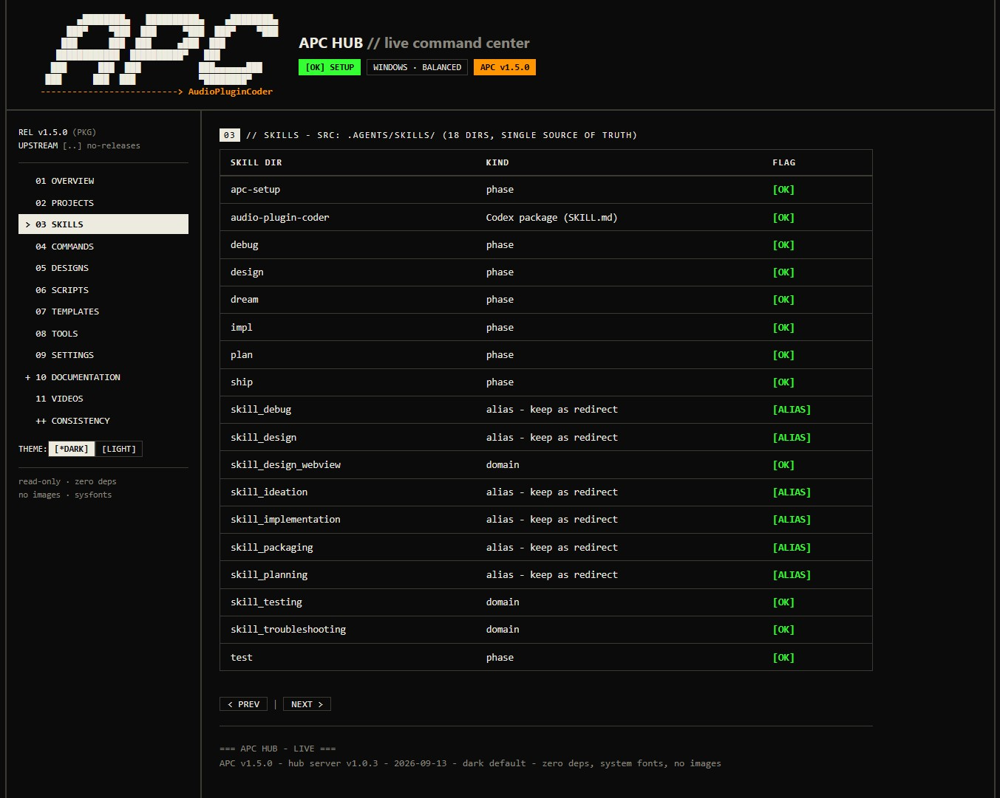
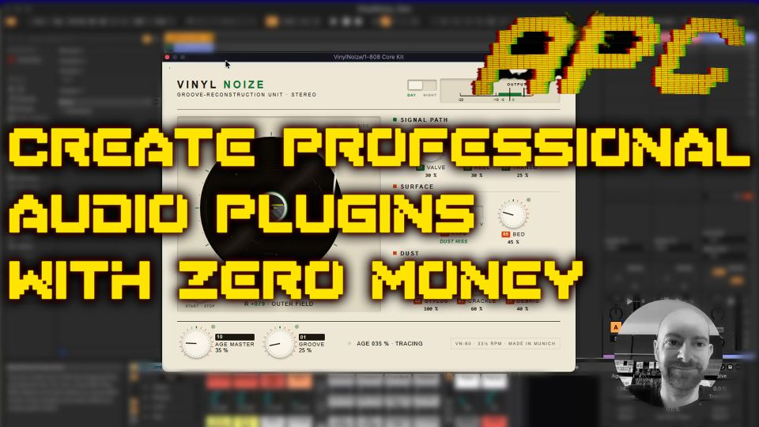

# Audio Plugin Coder (APC)


> AI-powered open-source framework for vibe-coding audio plugins from concept to shipped product

[](https://opensource.org/licenses/MIT)
[](https://github.com/Noizefield/audio-plugin-coder/blob/main/package.json)
[](https://juce.com/)
[](https://github.com/Noizefield/audio-plugin-coder)
[](https://github.com/hashgraph-online/hol-guard)
[](https://github.com/sponsors/Noizefield)

## What's new in v1.5.0

APC 1.5 is a big step forward - especially if you are a musician or hobbyist who just wants to build your own plugin without fighting tooling. Here is what changed, in plain words.

**The APC Hub - a window into your whole project.**
Instead of digging through folders and config files, you now get a live dashboard in your browser. Type `/apc-hub` (or run `node hub/server.js`) and you can see every plugin at a glance - which phase it is in, what still needs to be done, your design library, scripts, templates, tools and settings. Documentation is searchable and readable right there. You can even adjust your settings from a simple form instead of hand-editing JSON. It is read-only by default, so nothing breaks by accident.

**Works with more AI coding tools than ever.**
APC used to be picky about which assistant you used. In 1.5 that changed:

- **Codex is now fully on board.** Codex could not use slash commands like other assistants - APC now ships a proper Codex skill and plugin, with dedicated commands and optional cost-aware model routing (Luna, Terra, Sol, Astra).
- **Cursor is supported.** APC is ready out of the box in Cursor, including custom rules.
- **OpenCode is supported too.** All APC commands are wired up for it, exactly like Claude Code and Kilo.

**A single command-line tool.**
All the important tasks - version, paths, build, validate, backup, rollback, status - are now in one cross-platform tool (`apc`), tested by an automated suite. No more hunting for the right script.

**Improve and extend your plugins after release.**
Shipped a plugin? `/apc-patch` opens a focused bugfix round, `/apc-evolve` starts a feature upgrade. Your version number and state stay consistent automatically.

**Everything else got tidier too.**
Docs were rewritten to match reality, the framework version has one single source of truth, and releases now land in a clean `release/` folder that honors your configured paths.

Start: clone -> `/apc-setup` (Claude Code / Kilo / Cursor / OpenCode) or `$audio-plugin-coder:audio-plugin-coder setup` (Codex) -> `/apc-dream MyPlugin`.

## APC Hub

The APC Hub gives you a complete, live overview of the framework and your plugins - no build required, read-only by default:

```bash
node hub/server.js --port 4872   # or: /apc-hub in your agent
```



## Video Tutorial Series

<a href="https://www.youtube.com/watch?v=tD6T8MEGWm8&list=PLEOCbFL_Mq4o" target="_blank">

</a>

**APC Tutorial Series (YouTube Playlist)** - 7 episodes and more to come, explaining the framework in detail.

- Play the video: https://www.youtube.com/watch?v=tD6T8MEGWm8&list=PLEOCbFL_Mq4o
- Open the playlist on YouTube: https://www.youtube.com/playlist?list=PLEOCbFL_Mq4o

## About

**Audio Plugin Coder (APC)** is an AI-first framework that guides LLM agents through the whole plugin lifecycle - ideation, architecture, UI, DSP implementation, testing, and packaging - without the agent re-learning JUCE or your conventions every session. It is agent-agnostic (Codex, Claude Code, Kilo, Cursor, Antigravity) and has been hardened over 18 months of real plugin development.

The core workflow - `setup -> dream -> plan -> design -> impl -> ship` - is ready for production on Windows, macOS, and Linux.

## Which AI Coding Tools Work with APC?

APC is agent-agnostic: pick the assistant you already use. In v1.5.0 all major ones are first-class:

| Assistant | Status | How APC talks to it |
|---|---|---|
| **Codex** | ✅ Fully supported in 1.5.0 | Codex does not use slash commands - it gets a dedicated `audio-plugin-coder` skill and plugin with cost-aware model routing |
| **Cursor** | ✅ Ready out of the box | Custom rules + `/apc-*` commands, project guidance via `AGENTS.md` |
| **OpenCode** | ✅ Fully wired up | `/apc-*` commands with dedicated host shims |
| **Claude Code** | ✅ Fully supported | `/apc-*` commands |
| **Kilo** | ✅ Fully supported | `/apc-*` commands |
| **Antigravity / Gemini** | ✅ Supported | Natural language + `AGENTS.md` guidance |

Previously Cursor, OpenCode and Codex had only partial support. In 1.5.0 they now work the same way as Claude Code and Kilo - no workarounds needed.

## Key Features

- **LLM-driven development** - works with any coding agent
- **Guided setup** - `/apc-setup` configures toolchain, paths, and model routing via `apc.config.json`
- **Structured workflows** - Dream -> Plan -> Design -> Implement -> Ship, plus test/debug/status/resume/patch/evolve/hub
- **Unique slash commands** - `/apc-*` primary names; short aliases kept as deprecated
- **Dual UI frameworks** - Visage (pure C++) or WebView (HTML/CSS/JS + JUCE WebView)
- **State management** - per-plugin `status.json` with progress, validation, rollback
- **Self-improving** - auto-captured troubleshooting knowledge
- **JUCE 9 + CMake** - relocatable plugins/build/release directories
- **APC Hub** - live local dashboard and future workbench (`/apc-hub`)

## Quick Start

### One-command setup

```bash
npx github:Noizefield/audio-plugin-coder
```

Clones, checks your tools, and prints next steps for your platform. Requires [Node.js 18+](https://nodejs.org) and [Git](https://git-scm.com).

### Manual setup

```powershell
# Windows
git clone --recurse-submodules https://github.com/Noizefield/audio-plugin-coder.git
cd audio-plugin-coder
.\scripts\system-check.ps1 -Human
```

```bash
# macOS / Linux
git clone --recurse-submodules https://github.com/Noizefield/audio-plugin-coder.git
cd audio-plugin-coder
bash scripts/system-check.sh --human
```

Then open the repo in your agent and run `/apc-setup`, then `/apc-dream <PluginName>`.

### Prerequisites

| Platform | Requirements |
|---|---|
| **Windows** | LLM agent, Git, Node.js 18+, Python 3.8+, Visual Studio 2022 C++, CMake 3.22+, WebView2 Runtime, JUCE 9 (submodule), pluginval (submodule) |
| **macOS** | LLM agent, macOS 10.13+, Xcode + CLT, CMake 3.22+, Git, Node.js 18+, Python 3.8+, jq, JUCE 9, pluginval (WKWebView, no WebView2) |
| **Linux** | LLM agent, GCC 9+ / Clang 10+, C++20, CMake 3.22+, Make/Ninja, Node.js 18+, Python 3.8+, WebKitGTK, libegl-dev, ALSA (+JACK), JUCE 9, pluginval |

### Bridge Templates (FFGL & Max/MSP)

For FFGL visual plugins or Max for Live externals, run the Windows one-click setup:

```powershell
.\scripts\setup_bridges.bat
```

## How It Works

### The Five-Phase Workflow

```
SETUP  -> First-run toolchain, paths, model preferences
DREAM  -> Creative brief, parameter spec
PLAN   -> Architecture, UI framework, complexity
DESIGN -> GUI mockups and visual design
IMPL   -> DSP engine and UI integration
SHIP   -> Installers, DAW testing, distribution
```

### Agent Commands

Prefer the `/apc-*` names (unique across frameworks). Short aliases (`/dream`, ...) still work as deprecated. Codex invokes actions through the `audio-plugin-coder` skill (bare `/plan`/`/status` are Codex built-ins).

| Primary | Codex action | Description |
|---|---|---|
| `/apc-setup` | `$audio-plugin-coder:audio-plugin-coder setup` | First-run toolchain, paths, models |
| `/apc-dream [Name]` | `... dream [Name]` | Start new plugin (ideation) |
| `/apc-plan [Name]` | `... plan [Name]` | Architecture + UI framework |
| `/apc-design [Name]` | `... design [Name]` | GUI mockups and visual design |
| `/apc-impl [Name]` | `... impl [Name]` | Implement DSP and UI |
| `/apc-test [Name]` | `... test [Name]` | Run tests / validation |
| `/apc-debug [Name]` | `... debug [Name]` | Diagnose and fix issues |
| `/apc-ship [Name]` | `... ship [Name]` | Package and distribute |
| `/apc-status [Name]` | `... status [Name]` | Progress and state |
| `/apc-resume [Name]` | `... resume [Name]` | Continue from last incomplete phase |
| `/apc-new [Name]` | `... new [Name]` | Full workflow with confirmations |
| `/apc-patch [Name]` | `$audio-plugin-coder:audio-plugin-coder patch [Name]` | Bugfix generation on a shipped plugin |
| `/apc-evolve [Name]` | `$audio-plugin-coder:audio-plugin-coder evolve [Name]` | Feature generation on a shipped plugin |
| `/apc-hub` | `$audio-plugin-coder:audio-plugin-coder hub` | Open the live local dashboard |

See [Command Reference](docs/command-reference.md), [Codex Compatibility](docs/codex-compatibility.md), and [Model Routing](docs/model-routing.md).

### Example Session

```
You: /apc-setup
AI: ✅ Setup complete. Next: /apc-dream <PluginName>

You: /apc-dream TapeDelay / "Warm analog tape delay with wow/flutter"
AI: ✅ Dream phase complete! Files created: .ideas/creative-brief.md, .ideas/parameter-spec.md, status.json

You: /apc-design TapeDelay / "Teal dashboard, skeumorphic knobs"
AI: ✅ Design complete! Next: /apc-impl TapeDelay
```

## Architecture

APC tracks every plugin in a `status.json` (phase, validation, rollback). That lets you pause, switch agents, or rebuild state at any time.

```
audio-plugin-coder/
├── AGENTS.md                    # Agent guidance (AGENTS.md standard)
├── .agents/                     # Canonical source: workflows/, skills/, rules/, guides/, troubleshooting/
├── .codex-plugin/               # Codex plugin manifest
├── skills/                      # Packaged Codex skill (points at .agents/)
├── hub/                         # APC Hub - server.js, ui/, _design/
├── templates/                   # Plugin templates (visage, webview, ffgl, max-external)
├── docs/                        # Documentation (16 files)
├── scripts/                     # Build / state / validation automation (ps1 + sh)
├── bin/                         # setup.js, apc.js CLI
├── common/                      # Shared helpers (e.g. VisageJuceHost.h)
├── plugins/                     # Your plugins (config-relocatable)
├── build/                       # Compilation artifacts
├── release/                     # Ship packages (installers, zips)
└── test/                        # apc.js test suite (npm test)
```

Workflows orchestrate skills: `/apc-design` reads your UI framework from `status.json`, then loads the matching design skill. Troubleshooting auto-captures issues so the system improves over time.

## UI Framework Options

- **Visage (pure C++) - experimental** - Native frames, high performance, full C++ control.
- **WebView (HTML/CSS/JS)** - Modern web tech, hot reload, rich visualization.

The AI recommends a framework during planning based on your plugin's complexity.

## Supported Plugin Formats

| Format | Windows | macOS | Linux |
|---|---|---|---|
| VST3 | ✅ | ✅ | ✅ |
| Standalone | ✅ | ✅ | ✅ |
| AU | ❌ | ✅ | ❌ |
| LV2 | ❌ | ❌ | ✅ |

*CLAP support is planned.*

## Technology Stack

JUCE 9, CMake, PowerShell/Bash, WebView2 / WKWebView, YAML knowledge base, Node.js (CLI + Hub).

## Documentation

Docs live in [`docs/`](docs/): [Getting Started](docs/README.md), [Plugin Development Lifecycle](docs/plugin-development-lifecycle.md), [Command Reference](docs/command-reference.md), [Hub](docs/hub.md), [FAQ](docs/FAQ.md), [Troubleshooting](docs/troubleshooting-guide.md). The Hub serves them as a searchable reader.

## Roadmap

- [x] Windows / macOS / Linux local builds
- [x] GitHub Actions CI/CD, docs-as-truth, `apc` CLI, APC Hub
- [x] Visage + WebView UIs, FFGL + Max/MSP bridge templates
- [x] Codex, Cursor and OpenCode support
- [ ] CLAP format support
- [ ] Preset management, plugin marketplace, real-time collaboration

## Contributing & Community

Join [GitHub Discussions](https://github.com/Noizefield/audio-plugin-coder/discussions); see [CONTRIBUTING.md](CONTRIBUTING.md).

## Sponsor

Independent development with significant API costs. If APC saves you time, consider [sponsoring](https://github.com/sponsors/Noizefield) - it covers API costs and accelerates new features.

## Acknowledgments

- **JUCE Team** - the industry-standard framework
- **The AI community** - specifically the meta-prompting pioneers
- **Matt Tytel** - the Visage library (https://github.com/VitalAudio/visage)
- **[12Matt3r](https://github.com/12Matt3r)** - FFGL and Max/MSP bridge templates
- **[vjcharles](https://github.com/vjcharles)** - macOS support and security hardening (PR #6)

## License

MIT - see [LICENSE.md](LICENSE.md). Note: APC itself is MIT, but plugins built with it inherit JUCE's dual license (AGPLv3 free, or a [JUCE commercial license](https://juce.com/pricing/) for closed-source). [JUCE terms](https://juce.com/legal/juce-licence/).

---

*Built with a lot of tokens for the audio development community. Turn your plugin ideas into reality.*